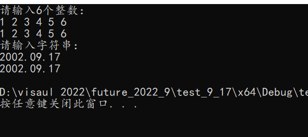
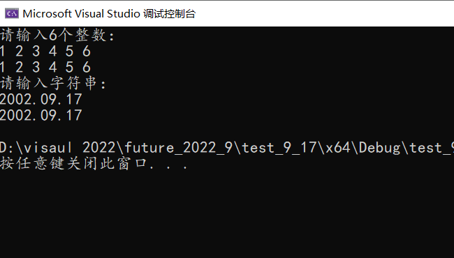
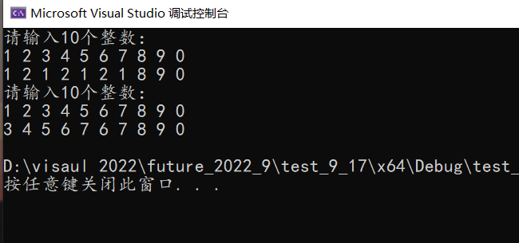
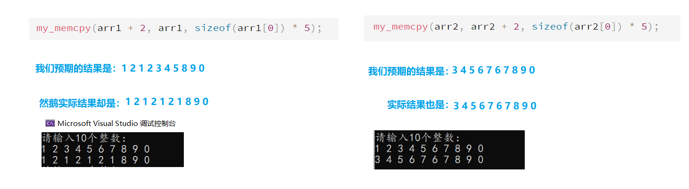
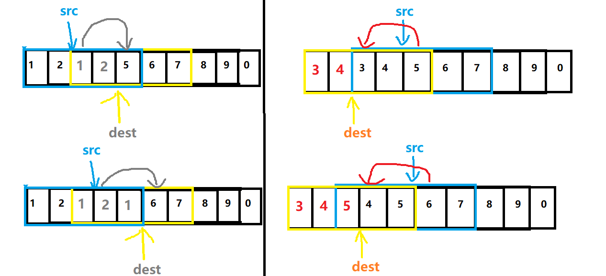
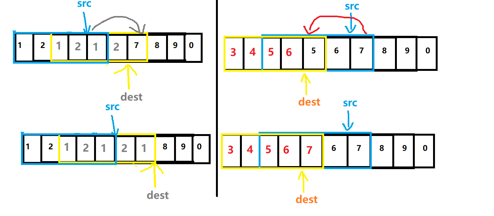
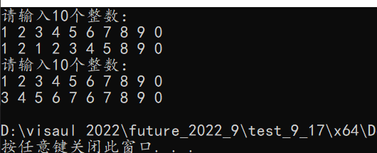
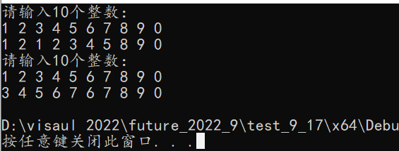

# C-Cpp C语言内存拷贝函数memcpy与memmove详解及模拟实现 CSDN(熊猫馆主) 2022-09-17

#### 2022-09-17 17:12:21

#### C-Cpp_Example_C语言内存拷贝函数memcpy与memmove详解及模拟实现_2022-09-17.md

----------------------------------------------------------------------------------------------------

文章目录

前言

一、memcpy函数 (内存拷贝) 的实验

二、memcpy函数的模拟实现

三、memmove函数 (内存移动) 的实验

四、memmove函数的模拟实现

总结

----------------------------------------------------------------------------------------------------

### 前言

c和c++使用的内存拷贝函数，memcpy函数和memmove函数的功能都是从源src所指的内存地址的起始位置开始拷贝n个字节到目标dest所指的内存地址的起始位置中。

```txt

要使用这两个库函数需要引用头文件 <string.h>

函数原型: 

void* memcpy(void* destination,const void* source,size_t num);

voidmemmove(void destination,const void* source,size_t num);

destination: 目的地指针 (首地址) 

source: 源头指针 (首地址) 

num: 需要复制的字节数

```

不过两者又略有差异，下面就让我们一起来一探究竟。

----------------------------------------------------------------------------------------------------

### 一、memcpy函数 (内存拷贝) 的实验

代码如下: 

```c

#include<stdio.h>
#include<string.h>

int main() {
    int arr1[6] = { 0 };
    int i = 0;
    puts("请输入6个整数: ");
    for (i = 0; i < 6; i++) {
        scanf("%d", arr1 + i);
    }
    int arr2[6] = {0};
    memcpy(arr2, arr1, sizeof(arr1[0]) * 6);
    for (i = 0; i < 6; i++) {
        printf("%d ", arr2[i]);
    }
    printf("\n");

    puts("请输入字符串: ");
    char arr11[60] = { 0 };
        scanf(" %[^\n]", arr11);
    char arr22[60] = { 0 };
    memcpy(arr22, arr11, sizeof(arr11[0]) * 60);
        printf("%s", arr22);
    printf("\n");
    return 0;
}

```

运行示例: 



----------------------------------------------------------------------------------------------------

### 二、memcpy函数的模拟实现

上面我们已经介绍了函数原型， void memcpy(void destination,const void* source,size_t num);

我们在模拟实现时对于数据的类型当然要保持一致，

memcpy有三个参数，分别是目的地指针、源头指针以及需要复制的字节数，

肯定有朋友会感到疑惑: 怎么这里接收指针时使用的是void* ？

这里我们说了: 这是一个内存函数，是直接对内存进行操作的，

所以，不管内存中的数据是什么类型的我都直接进行复制，

因此，这里使用void进行接收，因为void就像一个"垃圾桶"，什么类型的指针都可以放进去，

当然，既然是"垃圾桶"，那么里面的东西当然就是"不可再次使用的啦，"

嗯~，除非趁别人不注意时将它"捡起来重新洗干净"，

也就是说在使用 void指针进行运算时需要 强制类型转换，

因为 void* 不能和 char* 或者 int* 那样知道自己具体的大小，所以需要我们来提前告诉它。**

代码如下: 

```c

#include<stdio.h>
#include<string.h>
#include<assert.h>

void* my_memcpy(void* e1, const void* e2, size_t num) {
    assert(e1 && e2);
    //断言函数，判断指针e1,e2是否为NULL
    //需要包含头文件<assert.h>
    void* ret = e1;
    while (num--) {
        *(char*)e1 = *(char*)e2;
        e1 = (char*)e1 + 1;
        e2 = (char*)e2 + 1;
        //我们是对字节进行操作的，所以强转为char*
        //((char*)e1)++;在部分编译器上可能跑不过去
    }

    return ret;
}

int main() {
    int arr1[6] = { 0 };
    int i = 0;
    puts("请输入6个整数: ");
    for (i = 0; i < 6; i++) {
        scanf("%d", arr1 + i);
    }
    int arr2[6] = {0};
    my_memcpy(arr2, arr1, sizeof(arr1[0]) * 6);
    for (i = 0; i < 6; i++) {
        printf("%d ", arr2[i]);
    }
    printf("\n");

    puts("请输入字符串: ");
    char arr11[60] = { 0 };
        scanf(" %[^\n]", arr11);
    char arr22[60] = { 0 };
    my_memcpy(arr22, arr11, sizeof(arr11[0]) * 60);
        printf("%s", arr22);
    printf("\n");
    return 0;
}

```

运行示例: 



这里我们可以看到，memcpy函数十分方便，不管是什么类型的数据都可以进行复制，

但是，如果当我们要在一个数组内进行复制的时候，如果dest与src有重叠部分，那么使用memcpy就不一定会的得到我们想要的结果。

代码如下: 

```c

#include<stdio.h>
#include<assert.h>

void* my_memcpy(void* e1, const void* e2, size_t num) {
    assert(e1 && e2);
    void* ret = e1;
    while (num--) {
        *(char*)e1 = *(char*)e2;
        e1 = (char*)e1 + 1;
        e2 = (char*)e2 + 1;
    }

    return ret;
}

int main() {
    int arr1[10] = { 0 };
    int i = 0;
    puts("请输入10个整数: ");
    for (i = 0; i < 10; i++) {
        scanf("%d", arr1 + i);
    }
    my_memcpy(arr1 + 2, arr1, sizeof(arr1[0]) * 5);
    for (i = 0; i < 10; i++) {
        printf("%d ", arr1[i]);
    }
    printf("\n");

    int arr2[10] = { 0 };
    puts("请输入10个整数: ");
    for (i = 0; i < 10; i++) {
        scanf("%d", arr2 + i);
    }
    my_memcpy(arr2, arr2 + 2, sizeof(arr2[0]) * 5);
    for (i = 0; i < 10; i++) {
        printf("%d ", arr2[i]);
    }
    printf("\n");
    return 0;
}

```

运行实例: 









通过上图的变化路程可知: memcpy总是从低地址开始往高地址复制的，

但是当dest>src，并且目的地与源头有重叠时，使用memcpy会覆盖掉源头后面的数据，导致结果出错。

这个时候就需要进行判断，如果再次出现上面的事件，我们应当从高地址往低地址开始复制，

但是memcpy函数在设计时没有这种判断，

那么，我们就要使用其他的内存拷贝函数进行复制了，

下面我们来介绍memmove函数 (终于引了出来，嘎嘎努力!!)。

----------------------------------------------------------------------------------------------------

### 三、memmove函数 (内存移动) 的实验

代码如下: 

```c

#include<stdio.h>
#include<string.h>

int main() {
    int arr1[10] = { 0 };
    int i = 0;
    puts("请输入10个整数: ");
    for (i = 0; i < 10; i++) {
        scanf("%d", arr1 + i);
    }
    memmove(arr1 + 2, arr1, sizeof(arr1[0]) * 5);
    for (i = 0; i < 10; i++) {
        printf("%d ", arr1[i]);
    }
    printf("\n");

    int arr2[10] = { 0 };
    puts("请输入10个整数: ");
    for (i = 0; i < 10; i++) {
        scanf("%d", arr2 + i);
    }
    memmove(arr2, arr2 + 2, sizeof(arr2[0]) * 5);
    for (i = 0; i < 10; i++) {
        printf("%d ", arr2[i]);
    }
    printf("\n");
    return 0;
}

```

运行示例: 



----------------------------------------------------------------------------------------------------

### 四、memmove函数的模拟实现

**这里的memmove函数就完美解决了memcpy函数的"设计缺陷"

(其实memcpy设计时本就是只需要用它解决不同内存区域的内存拷贝的，而memmove是专门解决重叠内存区域内存拷贝的，大家各司其职，并没有高下之分。) 

那么下面我们就来模拟实现memmove函数吧。

代码如下: 

```c

#include<stdio.h>
#include<assert.h>

void* my_memmove(void* e1, const void* e2, size_t num) {
    assert(e1 && e2);
    void* ret = e1;
    if (e1 < e2) {
        int i = 0;
        while (num--) {
            *((char*)e1 + i) = *((char*)e2 + i);
            i++;
        }
    }
    else {//如果dest>=src，就倒着复制
        while (num--) {
            *((char*)e1 + num) = *((char*)e2 + num);
        }
    }
    return ret;
}

int main() {
    int arr1[10] = { 0 };
    int i = 0;
    puts("请输入10个整数: ");
    for (i = 0; i < 10; i++) {
        scanf("%d", arr1 + i);
    }
    memmove(arr1 + 2, arr1, sizeof(arr1[0]) * 5);
    for (i = 0; i < 10; i++) {
        printf("%d ", arr1[i]);
    }
    printf("\n");

    int arr2[10] = { 0 };
    puts("请输入10个整数: ");
    for (i = 0; i < 10; i++) {
        scanf("%d", arr2 + i);
    }
    memmove(arr2, arr2 + 2, sizeof(arr2[0]) * 5);
    for (i = 0; i < 10; i++) {
        printf("%d ", arr2[i]);
    }
    printf("\n");
    return 0;
}

```

运行示例: 



----------------------------------------------------------------------------------------------------

### 总结

以上就是memcpy和memmove的内容，

这里有两件值得一提的事情: 

1是现在在很多编译器下memcpy的功能已经和memmove一样了，也就是说memcpy也可以进行重叠内存区域的拷贝。

2是这两个函数其实和strcpy与strncpy十分十分相似，只不过后两者是仅限字符串使用而已。

----------------------------------------------------------------------------------------------------

那么今天的内容就讲解到了这里，感谢大家的支持，欢迎大家来评论区一起探讨，大家的鼓励是

继续更新的巨大动力。

----------------------------------------------------------------------------------------------------
### EOF
