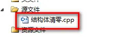
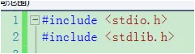
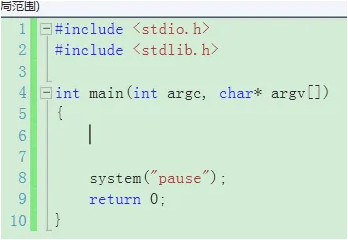
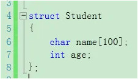
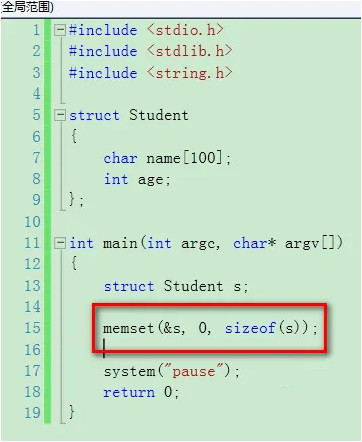

# C-Cpp Example C语言利用memset使结构体清零

#### Create at 2019-02-13

#### C-Cpp_Example_C语言利用memset使结构体清零_2019-02-13.md

--------------------------------------------------

1. 新建一个结构体清零项目，如图所示：

2. 添加一个结构体清零.cpp文件，如图所示：

3. 包含头文件，如图所示：

4. 输入main函数，如图所示：

5. 定义一个结构体，如图所示：

6. 使用memset函数给结构体清零，如图所示：

7. 至此，本教程结束！

--------------------------------------------------
EOF
