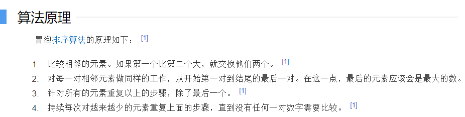
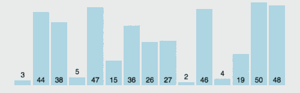
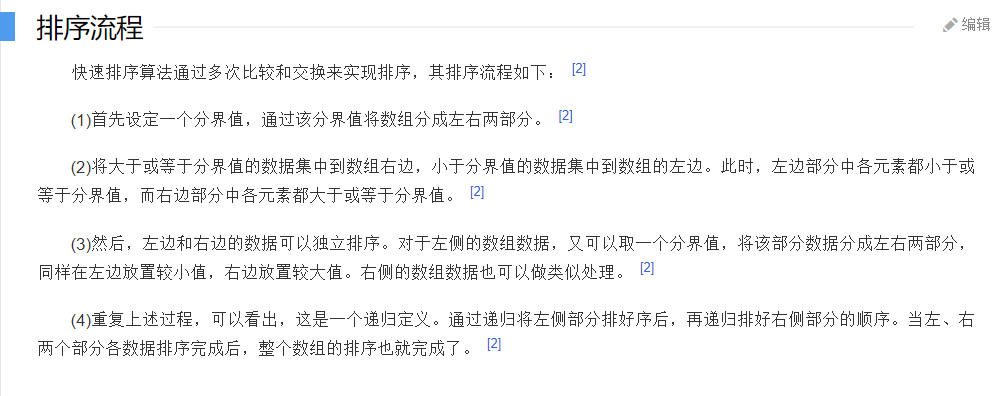
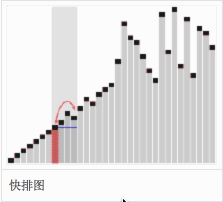
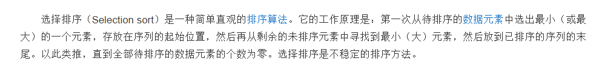
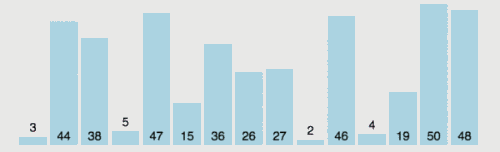
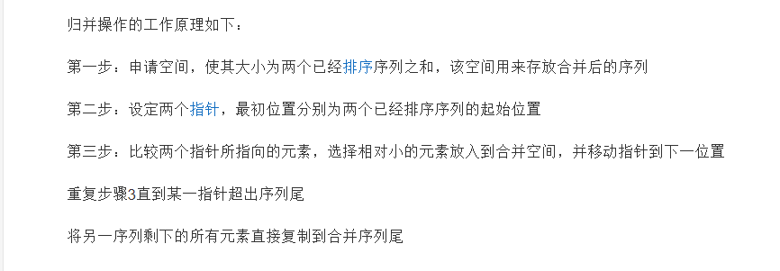
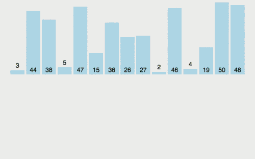

# C-Cpp Example C语言实现四种简单排序算法 灰信网 2021-01-14

#### 2021-01-14

#### C-Cpp_Example_C语言实现四种简单排序算法_2021-01-14.md

----------------------------------------------------------------------------------------------------

写在最前面的话: 

第一次开始写博客，愿以后自己也能把学习中的精彩记录下来，然后让很多朋友看到，一起学习，一起成长。

我现在是一个大一新生，刚接触算法没几天，对其产生了很大兴趣，但由于对编程语言的学习不到位，再加上自己动手写过的代码不多，接下来要写的这篇文章很可能不堪卒读……请大佬看到后到评论区多多批评指正，我不胜感激!!!

今天恰好学会了快速排序和归并排序，兴奋之余突发奇想，要把这些记录下来，再加上之前我学过的冒泡排序和选择排序一起整理出来，算是对自己学习的总结吧

----------------------------------------------------------------------------------------------------

### 一、 冒泡排序

1.定义



2.个人理解

冒泡排序就是通过元素之间不断地交换，把小的元素从右边“挤”到了左边，给大的元素腾出位置 (反过来也一样) ，就像从高到低排队一样，两个人比一下，长的高的就往后站，之后再和他后面的人比高低，经过不断地重复，就可以排好队了。

我在写这个算法的时候，经常犯的错误是搞错循环继续的条件，后来写了几次猴就把握了一点规律: 定义一个变量，判断是否执行交换，如果交换过，循环继续 (因为冒泡排序结束的标志是不再进行交换) 

3.动图演示



4.代码展示

```c

#include <stdio.h>
int a[100];
void swap(int *pa,int *pb)
{
    int  t = *pa;
        *pa=*pb;
        *pb=t;
}
void bubbleSort(int left,int right)
{
    int i, sign;
    do
    {
        sign = 0;
        for(i=left; i<=right-1; i++)
        {
            if(a[i]>a[i+1]) 
            {
                swap(&a[i],&a[i+1]);
                sign = 1;
            }
        }
    }while(sign==1);
}
int main()
{
    int i;
    for(i=0; i<6; i++)  scanf("%d", &a[i]);
    bubbleSort(0,5);
    for(i=0; i<6; i++)  printf("%d ", a[i]);
    return 0;
}

```

----------------------------------------------------------------------------------------------------

### 二、快速排序

1.定义



2.个人理解

快速排序类似于数学上的二分法，整体上是选一个中间的值，把小的移到左边，大的移到右边，然后对左边和右边再采取相同的操作，选一个中间值，小的移到左边，大的移到右边……

实际上， 我遇到的困难有怎样确定循环的写法，还有循环结束的条件，主要是没有熟练掌握递归的应用。一次排序里循环结束的条件是i==j，递归是为了对两部分再进行排序。

3.动图演示



4.代码展示

```c

#include <stdio.h>
int a[1000];
void swap(int *pa,int *pb)
{
    int t = *pa;
        *pa=*pb;
        *pb = t;
}
void quickSort(int left,int right)
{
    int i=left, j=right;
    int mid = a[(left+right)/2];
    do
    {
        while(a[i]<mid) i++;
        while(a[j]>mid) j--;
        if(i<=j)
        {
            swap(&a[i],&a[j]);
            i++;
            j--;
        }
    }while(i<=j);
    if(left<j)  quickSort(left,j);
    if(i<right) quickSort(i,right);
}
int main()
{
    int i;
    for(i=0; i<6; i++)  scanf("%d", &a[i]);
    quickSort(0,5);
    for(i=0; i<6; i++)  printf("%d ", a[i]);
    return 0;
}

```

----------------------------------------------------------------------------------------------------

### 三、选择排序

1.定义



2.个人理解

选择排序就是从数组中找到最小值，放到第一位，再找到第二小的值，放到第二位，依次类推，基本和平常的思维一样

用两重循环即可完成。

3.动图演示



4.代码展示

```c

#include <stdio.h>
int a[1000];
void swap(int *pa,int *pb)
{
    int t = *pa;
        *pa=*pb;
        *pb = t;
}
void selectSort(int left,int right)
{
    int i, j;
    for(i=left; i<right; i++)
    {
        int min=i;
        for(j=i+1; j<=right; j++)
        {
            if(a[min]>a[j])  min=j; 
        }
        swap(&a[i],&a[min]);
    }
}
int main()
{
    int i;
    for(i=0; i<6; i++)  scanf("%d", &a[i]);
    selectSort(0,5);
    for(i=0; i<6; i++)  printf("%d ", a[i]);
    return 0;
}

```

----------------------------------------------------------------------------------------------------

### 四、归并排序

1.定义



2.个人理解

归并排序操作上是将一个数组分成易于排序的小块，小块排好序之后再合并 (分成的小块只有一个数字时视为已排好序) ，所以如何合并才是关键，合并的时候不同的块里的某个数字要排在哪个位置还需要比较，按这个思路，就需要在待合并的两组数里，先让其中一组里的数固定，插到另一组数当中，再次这样做，直到排完。

两组数都可能有剩余，将剩余的数补到序列后面就可以了

3.动图演示



4.代码展示

```c

#include <stdio.h>
int a[1000], r[1000];
void mergeSort(int left,int right)
{
    if(left==right)     return;
    int mid = (left+right)/2;
    mergeSort(left,mid);
    mergeSort(mid+1,right);
    int i=left, j=mid+1, k=left;
    while(i<=mid&&j<=right)
    {
        if(a[i]<=a[j])
        {
            r[k] = a[i];
            i ++;
            k ++;
        }else
        {
            r[k] = a[j];
            j ++;
            k ++;
        }
    }
    while(i<=mid)
    {
        r[k]=a[i];
        i++;
        k++;
    }
    while(j<=right)
    {
        r[k]=a[j];
        j ++;
        k ++;
    }
    for(i=left; i<=right; i++)  a[i]=r[i];
}
int main()
{
    int i;
    for(i=0; i<6; i++)  scanf("%d", &a[i]);
    mergeSort(0,5);
    for(i=0; i<6; i++)  printf("%d ", a[i]);
    return 0;
}

```

----------------------------------------------------------------------------------------------------

真诚地希望有大佬前来提意见!!!

----------------------------------------------------------------------------------------------------
### EOF
