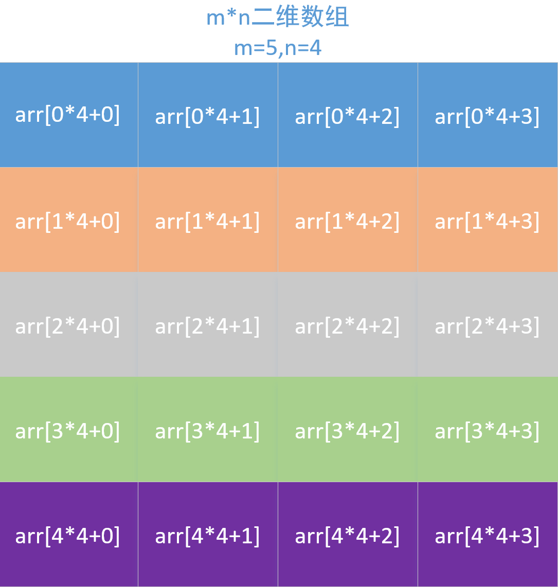
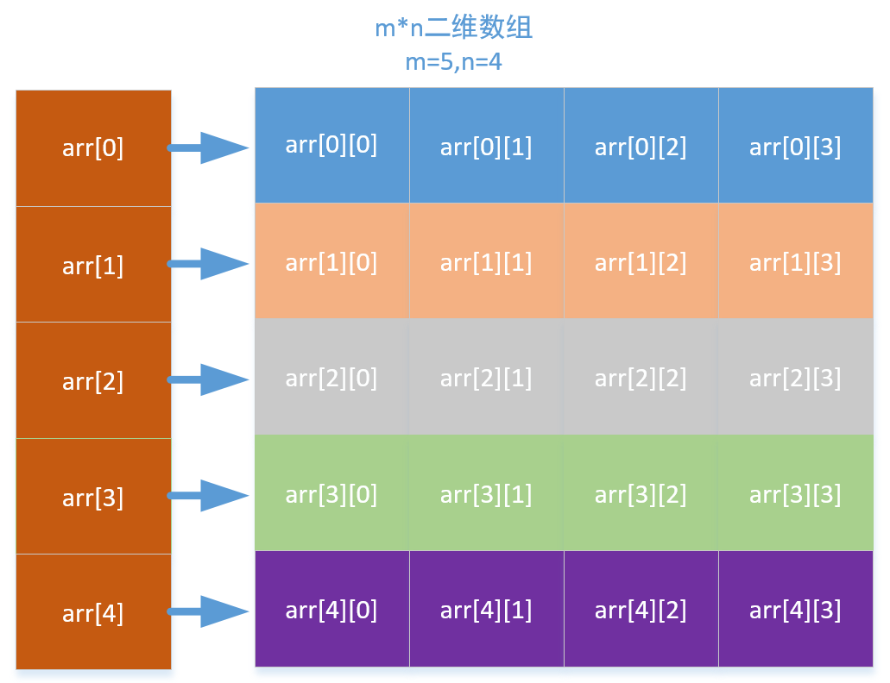

# C-Cpp Example C语言实现多层动态内存分配 创建二维数组 CSDN(小熊coder) 2021-09-09

#### Create at 2021-09-09 23:28:31

#### C-Cpp_Example_C语言实现多层动态内存分配_创建二维数组_2021-09-09.md

----------------------------------------------------------------------------------------------------

文章目录

一维数组动态内存分配

二维数组动态内存分配

一次分配

二次分配

包含结构体和二维数组的动态内存分配

----------------------------------------------------------------------------------------------------

### 一维数组动态内存分配

首先我么从简单的动态内存分配开始。

```c

#include "stdio.h"
#include "stdlib.h"
#define N 5

int main() {
    int* arr = (int*)malloc(sizeof(int)*N);

    for(int i = 0; i < N; i++) {
        arr[i] = i * i;
    }

    for(int i = 0; i < N; i++) {
        printf("\n%d", arr[i]);
    }

    free(arr);
    arr = NULL;
    for(int i = 0; i < N; i++) {
        printf("\n%d", arr[i]);
    }
}

```

一维数组的动态内存分配只需要根据需要分配数组元素的所需要的内存大小（sizeof(int)*N）。

----------------------------------------------------------------------------------------------------

### 二维数组动态内存分配

首先对于整齐的二维数组，分配方法是有两种：

* 一次性分配所有内存空间

* 分两次分配所有内存空间

#### 一次分配

假设要为一个 m*n 的数组分配内存空间，我们可以一次性分配所有内存空间。



```c

#include "stdio.h"
#include "stdlib.h"
#define m 5
#define n 4

int main() {
    int* arr = (int*)malloc(sizeof(int)*m*n);

    for (int i = 0; i < m; ++i) {
        for (int j = 0; j < n; ++j) {
            arr[i*n + j] = 99;
        }
    }

    for (int i = 0; i < m; ++i) {
        for (int j = 0; j < n; ++j) {
            printf("\n%d", arr[i*n + j]);
        }
    }

}

```

上面这种二维数组的内存分配很简单，但是使用起来不是很方便，因此这种方法我们一般很少使用。

#### 二次分配



```c

#include "stdio.h"
#include "stdlib.h"
#define m 5
#define n 4

int main() {

    int** arr = (int**)malloc(sizeof(int*)*m);

    for (int i = 0; i < m; ++i) {
        arr[i] = (int*)malloc(sizeof(int*)*n);
    }

    for (int i = 0; i < m; ++i) {
        for (int j = 0; j < n; ++j) {
            arr[i][j] = 99;
        }
    }

    for (int i = 0; i < m; ++i) {
        for (int j = 0; j < n; ++j) {
            printf("\n%d",arr[i][j]);
        }
    }
}

```

首先分配一个指针数组，数组中的每个元素都是一个数组指针，该指针又指向一个一维数组。后面再对该数组指针分配内存空间。对比前面一维数组的内存分配，这种二维内存的分配是分两次分配的，因此分配的内存是不连续的。

通过上面的内存分配方法，我们可以知道我们可以创建不整齐的二维数组。

```c

#include "stdio.h"
#include "stdlib.h"
#define m 5
#define n 4

int main() {
    int** arr = (int**)malloc(sizeof(int*)*m);

    arr[0] = (int*)malloc(sizeof(int*)*1);
    arr[1] = (int*)malloc(sizeof(int*)*2);
    arr[2] = (int*)malloc(sizeof(int*)*3);
    arr[3] = (int*)malloc(sizeof(int*)*4);
    arr[4] = (int*)malloc(sizeof(int*)*5);

    for (int i = 0; i < 1; i++) {
        arr[0][i] = 9;
    }
    for (int i = 0; i < 2; i++) {
        arr[1][i] = 9;
    }
    for (int i = 0; i < 3; i++) {
        arr[2][i] = 9;
    }
    for (int i = 0; i < 4; i++) {
        arr[3][i] = 9;
    }
    for (int i = 0; i < 5; i++) {
        arr[4][i] = 9;
    }

    for (int i = 0; i < m; ++i) {
        for (int j = 0; j < i+1; ++j) {
            arr[i][j] = 99;
        }
    }

    for (int i = 0; i < m; ++i) {
        for (int j = 0; j < i+1; ++j) {
            printf("\n%d", arr[i][j]);
        }
    }
}

```

----------------------------------------------------------------------------------------------------

### 包含结构体和二维数组的动态内存分配

```c

#include "stdio.h"
#include "stdlib.h"
#define m 5
#define n 4

typedef struct {
    int** sums;
    int sumsSize;
} NumMatrix;

int main() {
    int row = 5;
    int col[5] = {1, 2, 3, 4, 5};

    NumMatrix* ret = (NumMatrix*)malloc(sizeof(NumMatrix));
    ret->sums = (int **)malloc(sizeof(int*)*row);

    for (int i = 0; i < row; ++i) {
        ret->sums[i] = (int*)malloc(sizeof(int)*col[i]);
    }

    for (int i = 0; i < row; ++i) {
        for (int j = 0; j < col[i]; ++j) {
            ret->sums[i][j] = 99;
        }
    }

    for (int i = 0; i < row; ++i) {
        for (int j = 0; j < col[i]; ++j) {
            printf("\n%d", ret->sums[i][j]);
        }
    }
}

```

先来看看这段代码，在一个结构体中，存在一个二维数组指针。

因此我们分配内存的顺序应该按下面的步骤：

* 先为结构体分配内存

* 然后像前面分配二维数组内存那样分配内存

----------------------------------------------------------------------------------------------------
EOF
