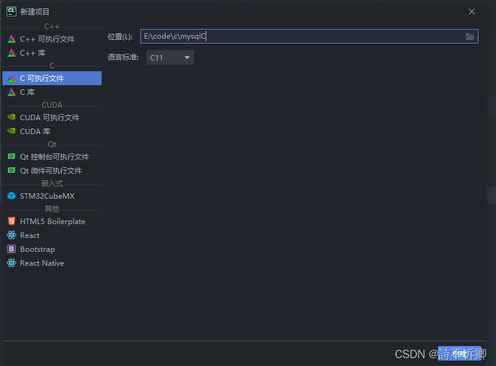
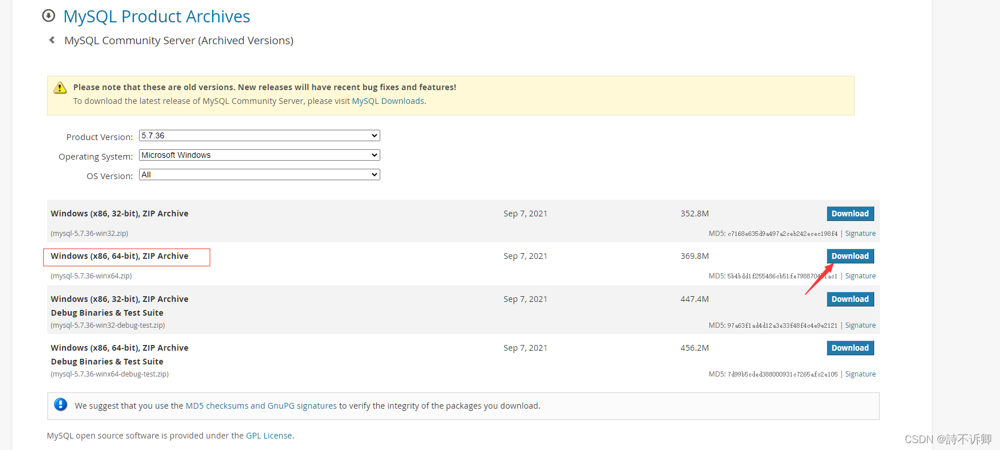
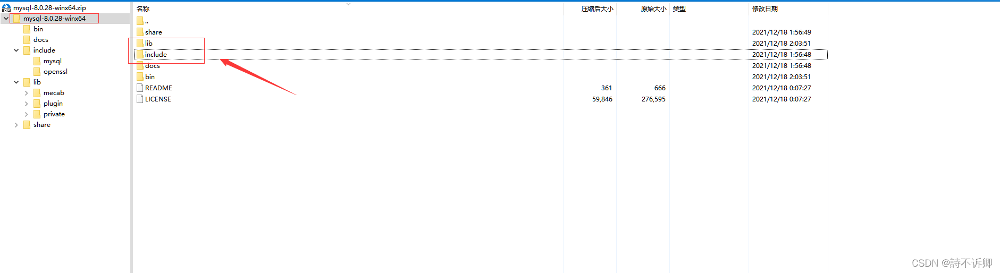
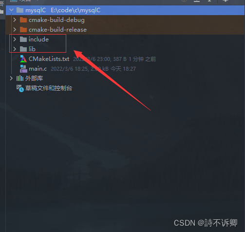
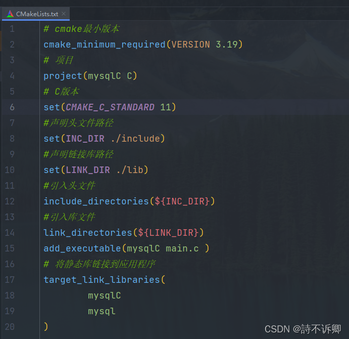
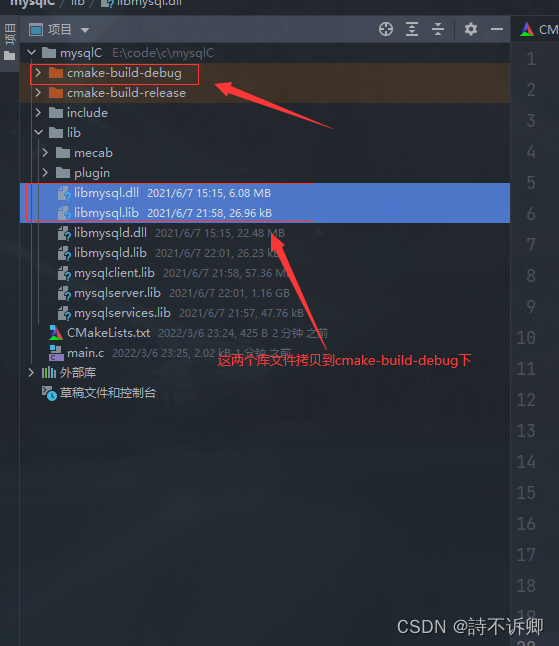
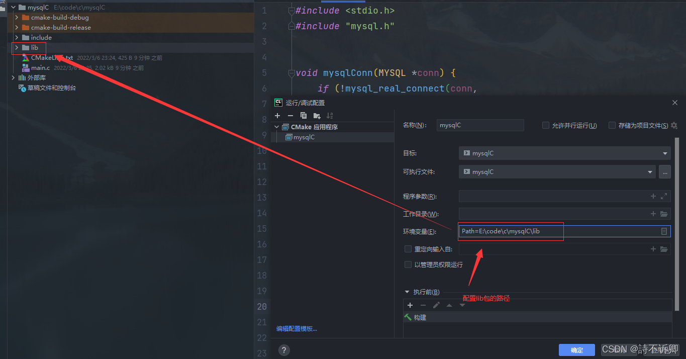
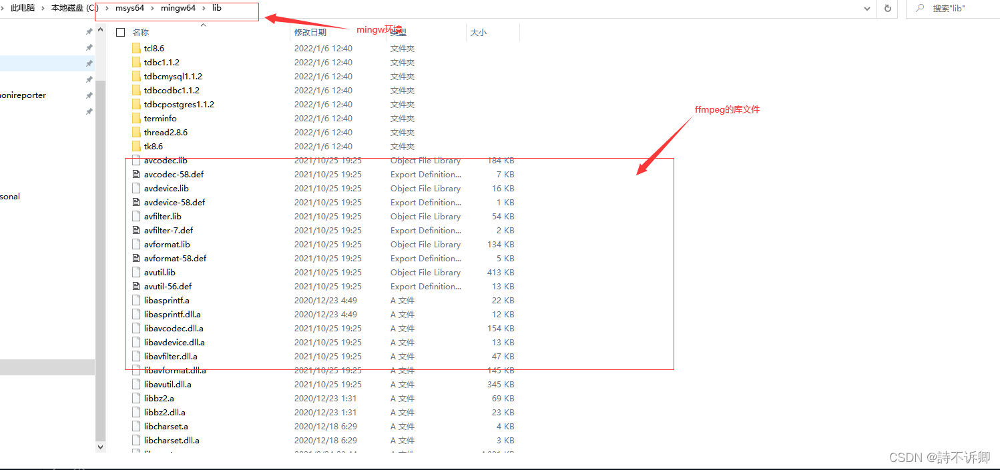
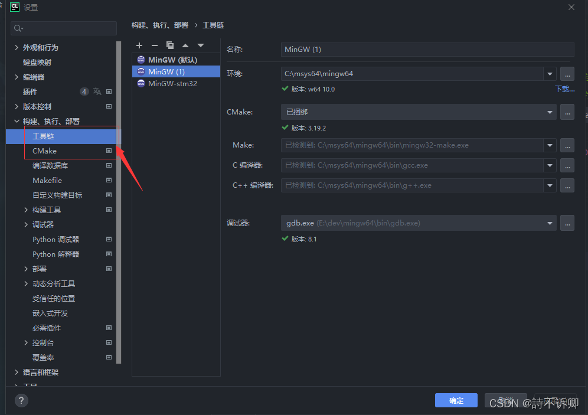
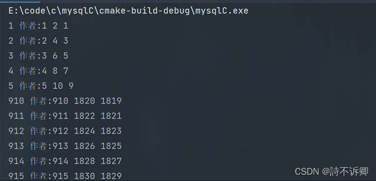

# C-Cpp Example C语言操作MySQL(5.7)初步学习 CSDN(诗不诉卿) 2022-03-07

#### Create at 2022-03-07 01:15:50

#### C-Cpp_Example_C语言操作MySQL(5.7)初步学习_2022-03-07.md

----------------------------------------------------------------------------------------------------

C语言操作Mysql初步学习

C语言操作MySQL

创建项目

拷贝MySQL的include文件夹和lib文件夹到项目路径

配置文件CMakeLists.txt

有个坑爹的地方(MySQL的库文件)

代码编写环境

背景知识(来源官网)

交互过程

代码编写环节(实操)

API参考(C MySQL)

--------------------------------------------------

### C语言操作MySQL

官方文档: https://dev.mysql.com/doc/c-api/5.7/en/

### 创建项目



### 拷贝MySQL的include文件夹和lib文件夹到项目路径

下载地址:https://downloads.mysql.com/archives/community/







### 配置文件CMakeLists.txt



### 有个坑爹的地方(MySQL的库文件)

方法一



方法二

配置环境变量,在环境变量Path中, 添加lib文件夹的路径



方法三(mysql这个没有试过, 但是应该可以; 之前搭建ffmpeg开发测试的时候, 就是将库文件拷贝过去的)

直接将lib文件夹里到安装的mingw64环境中



前提要对应



### 代码编写环境

采用的是方法一

#### 背景知识(来源官网)

```txt

The MySQL C API is a C-based API that client applications written in C can use to communicate with MySQL Server. Client programs refer to C API header files at compile time and link to a C API library file at link time. The library comes in two versions, depending on how the application is intended to communicate with the server:

libmysqlclient: The client version of the library, used for applications that communicate over a network connection as a client of a standalone server process.

libmysqld: The embedded server version of the library, used for applications intended to include an embedded MySQL server within the application itself. The application communicates with its own private server instance.

note:
    The libmysqld embedded server library is deprecated as of MySQL 5.7.19 and will be removed in MySQL 8.0.
The names of the library files to use when linking C API client applications depend on the library type and platform for which a distribution is built:

On Unix (and Unix-like) systems, the static library is libmysqlclient.a. The dynamic library is libmysqlclient.so on most Unix systems and libmysqlclient.dylib on macOS.

For distributions that include embedded server libraries, the corresponding library names begin with libmysqld rather than libmysqlclient.

On Windows, the static library is mysqlclient.lib and the dynamic library is libmysql.dll. Windows distributions also include libmysql.lib, a static import library needed for using the dynamic library.

```

* 在 Windows 上, 静态库是 mysqlclient.lib, 动态库是libmysql.dll. Windows 发行版还包括libmysql.lib使用动态库所需的静态导入库。

* 对于包含嵌入式服务器库的发行版, 相应的库名称为 mysqlserver.lib、 libmysqld.dll和 libmysqld.lib。

* Windows 发行版还包括一组调试库。这些与非调试库具有相同的名称, 但位于lib/debug库中。在编译使用调试 C 运行时构建的客户端时, 您必须使用调试库。

#### 交互过程

应用程序应该使用这个概要来通过客户端库与 MySQL 交互：

1. 通过调用初始化 MySQL 客户端库 mysql_library_init()。此函数存在于libmysqlclient C 客户端库和libmysqld嵌入式服务器库中, 因此无论您通过标志链接构建常规客户端程序 -libmysqlclient, 还是通过标志链接构建嵌入式服务器应用程序, 都可以使用此函数-libmysqld 。

2. 通过调用初始化连接处理程序 mysql_init()并通过调用连接到服务器 mysql_real_connect()。

3. 发出 SQL 语句并处理其结果。（以下讨论提供了有关如何执行此操作的更多信息。）

4. 通过调用关闭与 MySQL 服务器的连接 mysql_close()。

5. 通过调用结束 MySQL 客户端库的使用 mysql_library_end()。

#### 代码编写环节(实操)

只使用的select语句, 其它的mysql语句都差不多的

```c

#include <stdio.h>
#include "mysql.h"

/*
 *
主要用到的函数:
    mysql_library_init
    mysql_init 初始化
    mysql_real_connect 连接服务器
    mysql_query和mysql_real_query 执行sql语句, 区别请参考官网
    mysql_use_result 启用结果集, 按行数据进行迭代, 猜测内部结果是个链表
    mysql_store_result 将结果数据全部放入内存中, 如果数据量超大会出问题
    mysql_fetch_row 获取一行数据(是个二级字符指针)
    mysql_num_fields 获取查询结果的字段数据
    mysql_free_result 释放结果集所分配的内存
    mysql_close 关闭连接
    mysql_library_end
 */
int main() {
    // step 1 通过调用初始化 MySQL 客户端库 mysql_library_init()。
    if (mysql_library_init(0, NULL, NULL)) {
        fprintf(stderr, "could not initialize MySQL client library\n");
        exit(-1);
    }
    // step2 通过调用初始化连接处理程序 mysql_init()并通过调用连接到服务器 mysql_real_connect()。
    // MYSQL * mysql_init(MYSQL *mysql);
    MYSQL *conn = mysql_init(NULL);
    // 创建失败,官网说内存不足导致的(具体情况的话, 还要看源码逻辑)
    if (conn == NULL) {
        fprintf(stderr, "create mysql connecting failed\n ");
    }
    // 连接mysql
    // 如果MYSQL*连接成功, 则连接处理程序, NULL如果连接不成功。对于成功的连接, 返回值与第一个参数的值相同。
    conn = mysql_real_connect(conn, "localhost", "root", "123456", "sugartest", 3306, NULL, 0);
    if (conn == NULL) {
        fprintf(stderr, "连接mysql服务器失败\n ");
        exit(-1);
    }
    //设置查询编码为 utf8, 支持中文
    // 如果不设置, 后面查询的数据含有中文会出现乱码
    mysql_query(conn, "set names utf8");
    // 操作
    // 执行的sql语句编写
    char *execSql = "select * from tbl_author";
    // 执行sql
    // 自动提交
//    mysql_autocommit(conn, 1);
    mysql_real_query(conn, execSql, strlen(execSql));
    // 获取结果集
    // mysql_use_result()  启动逐行结果集检索
    MYSQL_RES *rs = mysql_use_result(conn);
//     将结果全部缓存到内存中
//    MYSQL_RES *rs = mysql_store_result(conn);
    // 判断是否有结果集
    if (rs) {
        // mysql_num_rows()    结果集中的行数
        // 在使用mysql_use_result获取结果集的时候, 始终为0, 原因是由于是按行数返回的
//        my_ulonglong totalRows = mysql_num_rows(rs);
//        fprintf(stdout, "总记录数:%llu\n", totalRows);
        // 二级指针
        MYSQL_ROW row;
        while ((row = mysql_fetch_row(rs))) {
//            mysql_num_fields()   结果集中的列数即字段
            for (int i = 0; i < mysql_num_fields(rs); ++i) {
                printf("%s ",row[i]);
            }
            printf("\n");
        }
    }
    // 释放结果集占用的内存
    mysql_free_result(rs);
    // 关闭conn
    mysql_close(conn);
    // 通过调用结束 MySQL 客户端库的使用 mysql_library_end()。
    mysql_library_end();
    return 0;
}

```

#### 执行结果



--------------------------------------------------

API参考(C MySQL)
https://dev.mysql.com/doc/c-api/5.7/en/c-api-basic-function-reference.html

----------------------------------------------------------------------------------------------------
EOF
