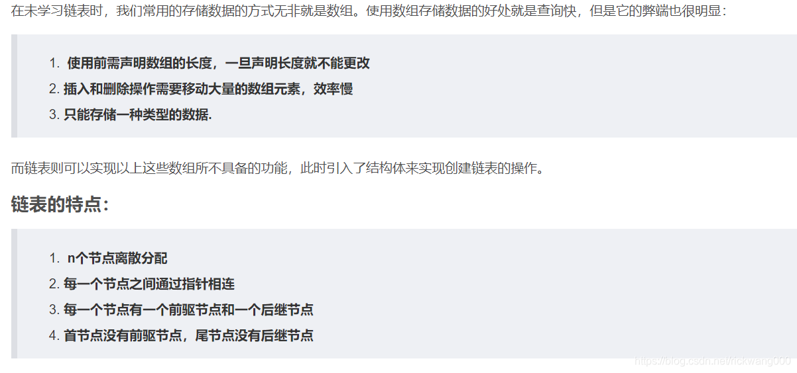
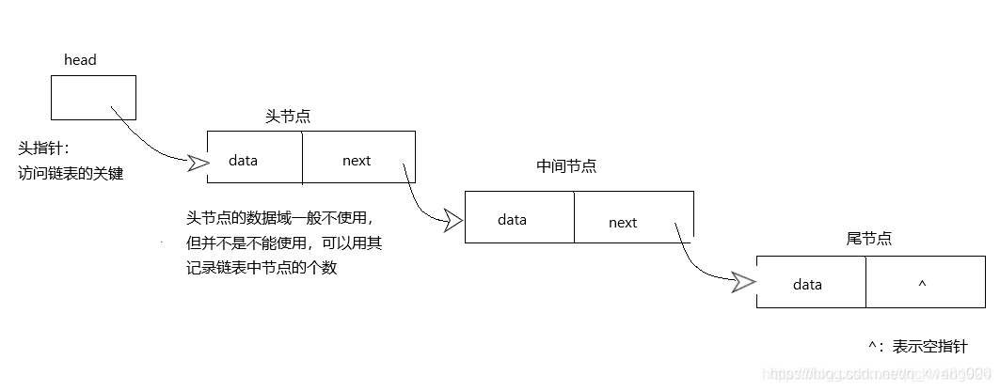

# C-Cpp Example C语言链表及其基本操作(适合入门)-CSDN(RickW00)

#### 2020-11-11 00:58:26

#### C-Cpp_Example_C语言链表及其基本操作(适合入门)_2020-11-11.md

----------------------------------------------------------------------------------------------------

链表及其基本操作

----------------------------------------------------------------------------------------------------

### 文章目录

链表及其基本操作

一、链表是什么?

二、链表是如何实现的

1.创建链表

2.输出链表

三、基本操作 (增删改查插) 

1.查找结点

2.删除结点

3.插入结点

4.清空结点

----------------------------------------------------------------------------------------------------

做为一名 新生蒟蒻来写第一篇博客>

最近在发愁如何做出一个有意思的项目来挑战自己，

但是因为能力有限被文件和链表的基本操作搞晕了，

所以来学巨佬的博客来写一写最近所学的链表操作和我对链表的理解

欢迎指教

----------------------------------------------------------------------------------------------------

### 一、链表是什么?

链表在最开始学习的时候就听说很难，但是去认真学习后却发现链表非常的好玩 ，是对于结构体和指针的一种实际应用 (个人理解) 。

那让我们先来说说什么叫链表: 

1. 链表是一种常见的数据结构。它与常见的数组是不同的，

2. 使用数组时先要指定数组包含元素的个数，即为数组的长度，

3. 但是如果向这个数组中加入的元素超过了数组的大小时，便不能将内容全部保存。

4. 链表这种存储方式，其元素个数是不受限定的，当进行添加元素的时候存储的个数就会随之改变。

5. 且对于元素的操作十分方便。

已经有大佬解释的对于链表的好处解释的十分清楚了。



----------------------------------------------------------------------------------------------------

### 二、链表是如何实现的

#### 1.创建链表

最重要的是定义一个结构体，其中存放你要存储的数据和你下个位置的地址。

```c

struct nod
{
    int date;
    struct nod* next;
};

```

因为链表是分散的，在茫茫人海中要去找到它难如登天，所以要有“*next”指针来找到下一个nod的位置。

如图



我们看到其中有有2个特殊的位置，首和尾 (滑稽) ，这也是我们创捷链表和查找链表的重要位置，可以知道从何开始，到哪结束。 (从哪来呀，到哪去) 。
    
```c

struct nod* creat(int n)
{
    struct nod * head = (struct nod *)malloc(sizeof(struct nod));
    struct nod * end=head;
    
    for(int i=0;i<n;++i)
    {
        struct nod * temp = (struct nod *)malloc(sizeof(struct nod));
        scanf("%d",&temp->date);
        end->next = temp;
        end = temp;
    }
    end->next = NULL;
    
    return head;
}

```

#### 2.输出链表

然后就是简简单单的输出了: 

```c

void printlist(struct nod * head)
{
    if(head == NULL)
        return ;
    
    struct nod * p = head;
        
    while(p->next!=NULL)
    {       
            p = p->next;//因为尾结点的next为空，为了可输出其值，这样巧妙使其可被输出。
            printf("%d",p->date);
    
    }   
    
    return ;
}

```

----------------------------------------------------------------------------------------------------

### 三、基本操作 (增删改查插) 

#### 1.查找结点

返回你需要查找的位置

```c

struct nod * Findnod(struct nod * head,int a)
{
    if(head == NULL)
        return NULL;
        
    struct nod * temp = head;   
        
    while(temp->next != NULL)
    {
        temp = temp->next;
        if(temp->date == a)
            return temp;
    } 
    
    return NULL;//没找到 
    
}

```

#### 2.删除结点

找到你要删除结点的前一个结点，然后是前结点的next等于该节点的next即可。

#### 3.插入结点

与指定位置增加结点，并赋值。

```c

void addnod(struct nod * head,int a)
{
    if(head == NULL)
        return ;
        
    struct  nod * temp  = Findnod(head,a);
    
    struct  nod * newnod = (struct  nod *)malloc(sizeof(struct  nod ));
    
    scanf("%d",&newnod->date);
    
    newnod->next = temp->next;
    temp->next = newnod;
    
    return ;
} 

```

#### 4.清空结点

```c

void FreeList()
{
    //一个一个NULL
    struct Node *temp =head;        //定义一个临时变量来指向头
    while (temp !=NULL)
    {
    //  printf("%d\n",temp->a);
        struct Node* pt =temp;
        temp = temp->next;      //temp指向下一个的地址 即实现++操作
        free(pt);                   //释放当前
    }
    //头尾清空  不然下次的头就接着0x10
    head =NULL;
    end =NULL;
}

```

----------------------------------------------------------------------------------------------------
### EOF
